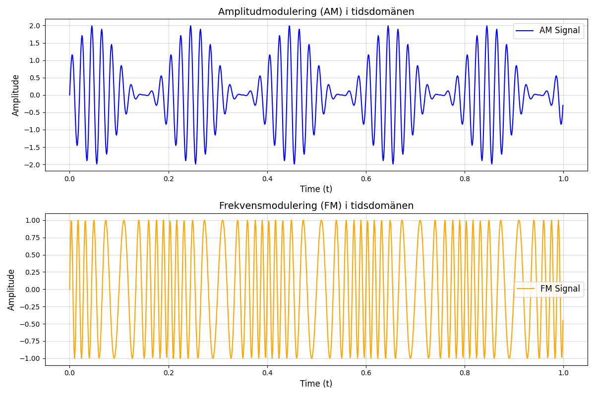
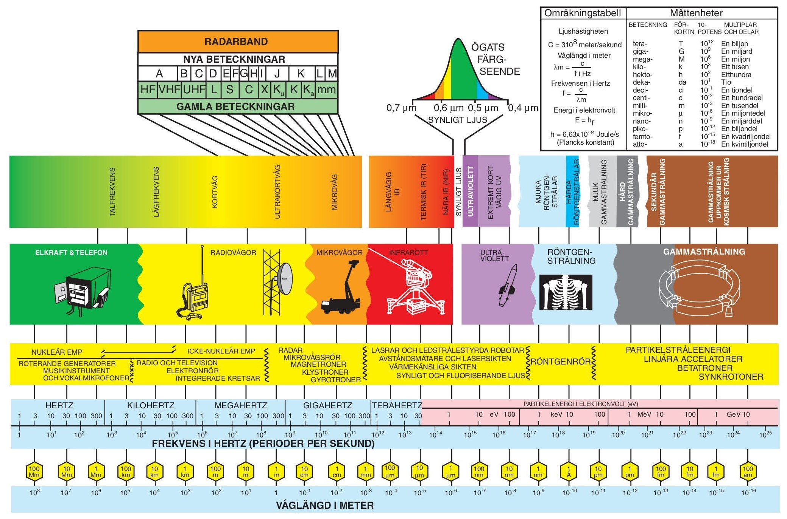
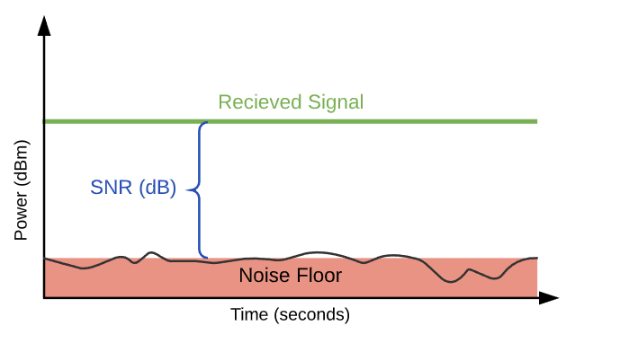
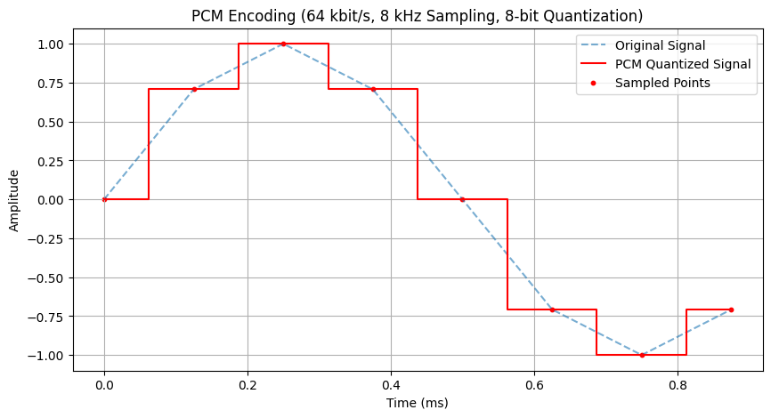

# Vad är en signal?

### Syftet med utbildningen

Att ge individen, oberoende fördjupningsområde, en förståelse för grundläggande fysik med utgångspunkt från specifik verksamhet och nomenklatur. Utbildningen skall genomföras under individens första tid för att ge möjligheten att se samband mellan fysik och de begrepp och den teknik som vardagen består av. Känslan av att verksamheten består av ”svart magi” ska minska. Utbildningen skall också ses som en grund till vidare teknisk utbildning inom respektive fördjupningsområde.

### Målet med utbildningen

Efter genomförd utbildning ska individen kunna se grundläggande samband mellan fysik och teknik inom följande områden:

- Sinusvågen
- Tid och frekvens
- dB och brus
- Kapacitet
- Signalens väg

### Avgränsningar

Utbildningen syftar inte till att förklara hur tekniken fungerar då det tillhör utbildning som genomförs inom ramen för respektive fördjupningsområde.

Den syftar heller inte till att härleda fysikaliska och matematiska samband utan istället skall sambanden påvisas.

### Tidsåtgång

TBD

## Index

- [Kapitel 1: Sinusvågen](#chapter-1-sinusvagen)
- [Kapitel 2: Tids och frekvensdomän](#chapter-2-tid-v-fq)
- [Kapitel 3: Frekvensspektrumet](#chapter-3-frekvensspektrumet)
- [Kapitel 4: Signal till brus](#chapter-4-signal-till-brus)
- [Kapitel 5: Kapacitet](#chapter-5-kapacitet)
- [Kapitel 6: Signalens väg](#chapter-6-signalens_vag)

---

<h2 id="chapter-1-sinusvagen">Kapitel 1: Sinusvågen</h2>

### Definition

Oberoende överföringsteknik eller kommunikationsform är det sinusvågen som är möjliggöraren. När sinusvågen färdas i ett godtyckligt medium breder den ut sig likt vågringar på vatten. Vågen existerar i tre dimensioner. 

 

> *"En sinusvåg är den naturliga svängningsrörelsen för ett fritt svängande system."* Här finns mer att läsa om [sinusvågen.](https://sv.wikipedia.org/wiki/Sinusv%C3%A5g)

 
Sinusvågen definieras med hjälp av ett antal egenskaper.

 

$y(t) = A \cdot \sin(2 \pi f t + \phi)$

- $A$ = Kurvans amplitud
- $f$ = Kurvans frekvens
- $\phi$ = Kurvans fasförskjutning

### Varför är det viktigt?

När en sinusvåg färdas i ett godtyckligt medium, gör den det i form av elektromagnetisk energi och benämns ofta som en *radiosignal*. En sändare genererar signalen som i sin tur tas emot av mottagaren. För att signalen ska kunna bära information behöver sändaren och mottagaren komma överens om ett gemensamt "språk". Sändaren behöver alltså ändra signalens egenskaper så att mottagaren i sin tur kan översätta ändringarna till information.

Dessa egenskapsförändringar, eller anpassningar, benämns *modulation*. När sändaren modulerar en signal och överför den, kommer mottagaren att *demodulera* samma signal för att komma åt informationen. 

---

<h2 id="chapter-2-tid-v-fq">Kapitel 2: Tids och frekvensdomän</h2>

### Definition

I föregående kapitel har vi undersökt matematiska och fysikaliska fenomen med fokus på tid, där tiden representerade x-axeln i grafen. Ett annat, och minst lika vanligt sätt att beskriva en signal är att analysera den utifrån dess frekvens.

- **Tidsdomän**: Visar hur en signal förändras över tid. Här kan du observera signalens värde vid varje givet ögonblick.
- **Frekvensdomän**: Visar fördelningen av signalen över olika frekvenser, det vill säga hur mycket av signalen som finns vid varje frekvens.

### Varför är det viktigt?
Det finns många anledningar till varför det är viktigt att kunna analysera en signal i olika domäner. Den mest uppenbara är att det förenklar studiet av repetitiva fenomen, såsom radiovågor. 

I grafen nedan visas en signal i **tidsdomänen**, där **tid (s)** är på x-axeln, samt en signal i **frekvensdomänen**, där **frekvens (Hz)** är på x-axeln.

 

 

> Frekvensen är det inverterade värdet av periodtiden:   $f = 1 / T$

> Sambandet mellan ljusets utbredningshastighet c i vakuum, frekvensen f och våglängden λ:   $λ = c / f$  

> *Transformteori* är ett sammanfattande namn på de delar av matematiken som beskriver transformer. Här kan du läsa mer om [Fouriertransform.](https://sv.wikipedia.org/wiki/Fouriertransform)

---

<h2 id="chapter-3-frekvensspektrumet">Kapitel 3: Frekvensspektrumet</h2>

### Definition
Ett frekvensspektrum är ett avgränsat område med frekvenser. Inom radiotekniken anses det användbara frekvensområdet omfatta frekvenser mellan 10 kHz till 300 GHz. Det är dock långt ifrån det enda definierade frekvensspektrumet. Som exempel nyttjas spektrumet för ljus när information överförs i [fiberoptisk kabel.](https://en.wikipedia.org/wiki/Wavelength-division_multiplexing)

 

I figuren nedan ses en skärmdump tagen över ett skarpt frekvensspektrum. En radiomottagare som kopplats till en dator har konfigurerats att motta signaler runt omkring 140 MHz - 150 MHz. X-axeln visar frekvensen och y-axeln visar amplituden. Mitt i figuren ses ett antal signaler som i detta fall bär en nyttosignal. Flera av de nyttosignaler som mottagaren tar emot har mjukvaran markerat med gula cirklar för att påvisa signalens amplitud. 

Utöver att mottagaren tar emot signalen med en viss signalstyrka, allokerar signalens bredd ett visst frekvensutrymme. Signalens bredd benämns bandbredd. Bandbredden är ett mått på det frekvensområde som en signal upptar, och en högre informationsöverföringshastighet kräver ett större frekvensområde för att kunna överföra mer data per tidsenhet.

I foten på nyttosignalerna ses ett blått område som övergår i svart. Området består av brus där "taket" av rektangeln benämns brusgolv. Brus är en signal där vi inte känner signalens tidsfunktion, utan bara dess amplitudspektrum. Brus alstras av flera olika, av varandra oberoende generatorer. Alstringen sker bland annat i atmosfären, i rymden och internt i vår mottagare. Brus har egenskapen att amplituden följer normalfördelningsprincipen.

### Varför är det viktigt?

Den fysikaliska faktorn avgränsar oss till att använda vissa frekvenser även fast frekvenserna, inom ramen för signalteorin kan anta ett oändligt antal värden. Vi måste också förhålla oss till den omgivning som vi sänder och mottager i. En för svag mottagen signal löper risk att "försvinna" i bruset.

Överföring av information med hjälp av elektromagnetisk energi kommer alltså med begränsningar. Mer om dessa begränsningar i efterföljande kapitel.

 

> Här kan du förkovra dig i brus; [AGWN.](https://en.wikipedia.org/wiki/Additive_white_Gaussian_noise)

> Vill du börja leta signaler? Hobbyn är billig och kräver ingen särskild förkunskap. Läs mer om [SDR.](https://www.rtl-sdr.com/rtl-sdr-quick-start-guide/)

---

<h2 id="chapter-4-signal-till-brus">Kapitel 4: Signal till brus</h2>

### Definition

När en signal sänds från en sändare överförs den med en viss effekt (W). Under överföringen utsätts signalen för *dämpning* innan den når mottagaren. Alla delar i signalkedjan som inte förstärker signalen kommer att påverka den negativt, till exempel förlust i kablar eller spridning i fri rymd. Dämpningen är även frekvensberoende, där den ökar med högre frekvenser.

När mottagaren tar emot signalen, gör den detta med en viss kvalitet. Kvaliteten på signalen kan mätas på olika sätt. Ett vanligt mått är **signal-brus-förhållande** (SNR), vilket representerar skillnaden i nivå mellan signalen och det omgivande bruset. SNR mäts i decibel (dB).

Det logaritmiska måttet dB är ett användbart verktyg när stora och små värden hanteras samtidigt. Genom att använda dB kan till exempel en hög och låg signalstyrka jämföras även fast de linjära värdena ligger långt från varandra. dB är ett relativt mått och har per definition ingen enhet. Måttet refereras istället till en effektnivå.

 

$dBm = 10 \cdot \log_{10}(mW) + 30$

 

  
| Linjär (mW)   | Logaritmisk (dBm)  | 
|---------------|--------------------|
| 1             | 0                  |
| 2             | 3                  |
| 10            | 10                 |
| 100           | 20                 |
| 1000          | 30                 |

| dBm   | Sändare     |
|-------|-------------|
| 80    | Rundradio   |
| 60    | Mikrovågsugn|
| 27    | Mobilsite   |
| 15    | WiFi        |
| 10    | Bluetooth   |

### Varför är det viktigt?
När ett system för kommunikationsöverföring designas måste tillgänglig effekt budgeteras, vilket kallas för [länkbudget.](https://pysdr.org/content/link_budgets.html) Genom att räkna på signalstyrkan för varje steg i överföringskedjan och analysera förluster är det i slutändan mottagarens tolerans för SNR som är gränssättande. Om insignalen till mottagaren har utsatts för hög dämpning under överföringen riskerar signalen försvinna i bruset och informationen går förlorad.

 

Ett sätt att visualisera hur en digital signal uppträder i en mottagare är att använda ett konstellationsdiagram. Desto mer brus som signalen ([QPSK](https://en.wikipedia.org/wiki/Phase-shift_keying)) utsätts för, desto svårare har mottagaren att uppfatta rätt symbol. Resultatet blir att bitfelssannolikheten (BER) ökar med minskad SNR.  

> Ett sätt att ta höjd för höga bitfelshalter är att nyttja [kanalkodning.](https://pysdr.org/content/channel_coding.html)

---

<h2 id="chapter-5-kapacitet">Kapitel 5: Kapacitet</h2>

### Definition

När en godtycklig mängd information överförs över en *kanal*, har kanalen en specifik kapacitet (*D*), vilket definierar den maximala mängden information som kan överföras per tidsenhet utan att informationen förloras eller förvrängs. Kapaciteten beror på flera faktorer, såsom kanalens bandbredd, signalstyrka samt förekomsten av brus och störningar.

Kanske den mest fundamentala formen av definierad kapacitet är den som en traditionell telefonförbindelse inom det fasta telenätet erbjuder. Talkodaren för fasta telenätet är en vågformskodare, som känner av (samplar) talsignalens amplitud 8000 ggr per sekund. Spänningen i varje sample beskrivs med 8 databitar.

 

$D = 8 \frac {bit}{samples} \cdot 8k \frac {samples}{sec} = 64kbit/sec$

 

> Läs mer om sampling och Nyquists [samplingsteorem.](https://pysdr.org/content/sampling.html)

### Varför är det viktigt?

När ett telekomföretag idag investerar i ny kommunikationsteknologi sker det främst utifrån ett krav: kapacitet. Med framväxten av 5G-teknologi har detta krav blivit ännu mer centralt, då 5G erbjuder avsevärt högre kapacitet jämfört med tidigare generationer av kommunikationsteknologier.

| Teknologi             | Kapacitet                                                                                                |
|-----------------------|----------------------------------------------------------------------------------------------------------|
| PDH                   | <ul><li>E1: 2048 Mbit/s</li></ul>                                                                        |
| SDH                   | <ul><li>STM-1: 155,52 Mbit/s</li><li>STM-4: 622,08 Mbit/s</li><li>STM-16: 2,488 Gbit/s</li></ul>         |
| Ethernet              | <ul><li>1G: 1 Gbit/s</li><li>10G: 10 Gbit/s</li></ul>                                                    |
| Fiberoptiska nät      | <ul><li>WDM: flertalet Tbit/s</li></ul>                                                                 |
| Satellitkommunikation | Abonnemang                                                                                               |
| 4G LTE                | Upp till 1.5 Gbit/s                                                                                      |
| 5G NR                 | Upp till 20 Gbit/s                                                                                       |

---

<h2 id="chapter-6-signalens_vag">Kapitel 6: Signalens väg</h2>

Workshop och labb

---

**Skapare:** Johannes Andersson

**Datum uppdaterad:** 2025-02-17