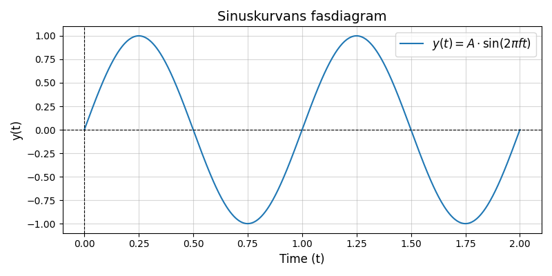
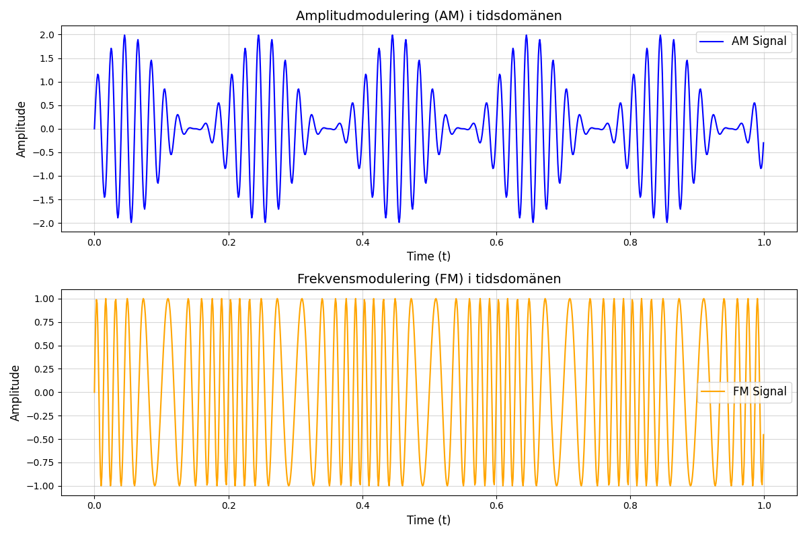

# Vad är en signal?

## Index

- [Kapitel 1: Sinusvågen](#chapter-1-sinusvagen)
- [Kapitel 2: Tids och frekvensdomän](#chapter-2-tid-v-fq)
- [Chapter 3: Advanced Topics](#chapter-3-advanced-topics)

---

<details>
<summary><h2 id="chapter-1-sinusvagen">Kapitel 1: Sinusvågen</h2></summary>

### Definition

Oberoende överföringsteknik eller kommunikationsform är det sinusvågen som är möjliggöraren. När sinusvågen färdas i ett godtyckligt medium breder den ut sig likt vågringar på vatten. Vågen existerar i tre dimensioner. 

<br>

> *"En sinusvåg är den naturliga svängningsrörelsen för ett fritt svängande system."*

<br>
Sinusvågen defineras med hjälp av ett antal egenskaper.
<br>



<div align="center">

$y(t) = A \cdot \sin(2 \pi f t + \phi)$

</div>

- $A$ = Kurvans amplitud
- $f$ = Kurvans frekvens
- $\phi$ = Kurvans fasförskjutning


### Varför är det viktigt?

När en sinusvåg färdas i ett godtyckligt medium vid vissa frekvenser, gör den det i form av elektromagnetisk energi och benäms *signal*. En sändare genererar signalen som i sin tur tas emot av mottagaren. För att signalen ska kunna bära information behöver sändaren och mottagaren komma överens om ett gemensamt "språk". Sändaren behöver alltså ändra signalens egenskaper så att mottagaren i sin tur kan översätta ändrigarna till information.

Dessa engenskapsförändringar, eller anpassningar, benäms *modulation*. När sändaren modulerar en omodulerad signal (CW) och överför den, kommer mottagaren att *demodulera* samma signal för att komma åt informationssignalen. 



<!---
17_lektioner.pdf sidan 65
-->

</details>

---

<details>
<summary><h2 id="chapter-2-tid-v-fq">Kapitel 2: Tids och frekvensdomän</h2></summary>

### Key Topics

- Topic A: Description
- Topic B: Description

### Examples

```python
# Example code snippet
print("Hello, world!")
```

### Diagrams or Images


### Exercises

1. Question 1
2. Question 2

### Additional Reading

- [External Article 1](#)
- [External Article 2](#)

</details>

---

<details>
<summary><h2 id="chapter-3-advanced-topics">Chapter 3: Advanced Topics</h2></summary>

### Deep Dive

Discuss advanced details or techniques.

### Case Studies

Provide real-world examples and solutions.

### Notes Section
>
> Tip: Use this area to jot down important notes during your study.

### Quiz Questions

- Question 1
- Question 2

### Further Exploration

- [Research Paper 1](#)
- [Video Tutorial](#)

</details>

---

### Footer

**Author:** [Your Name]  
**Date Created:** [Insert Date]  
**Feedback:** [Provide Feedback Here](#)
