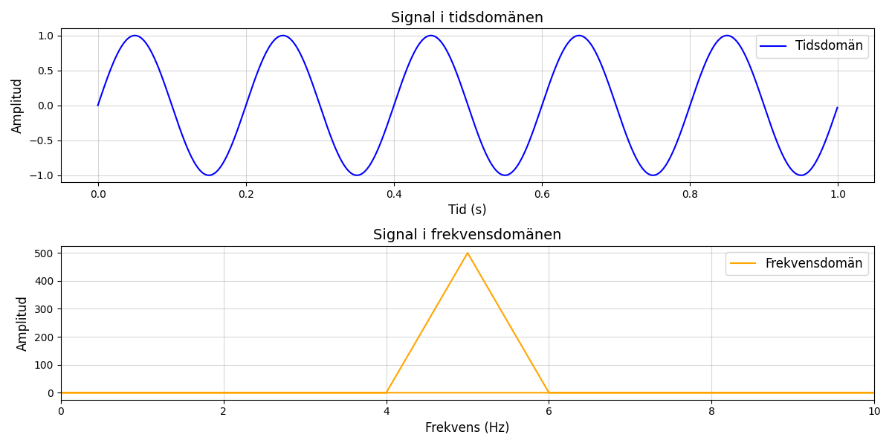
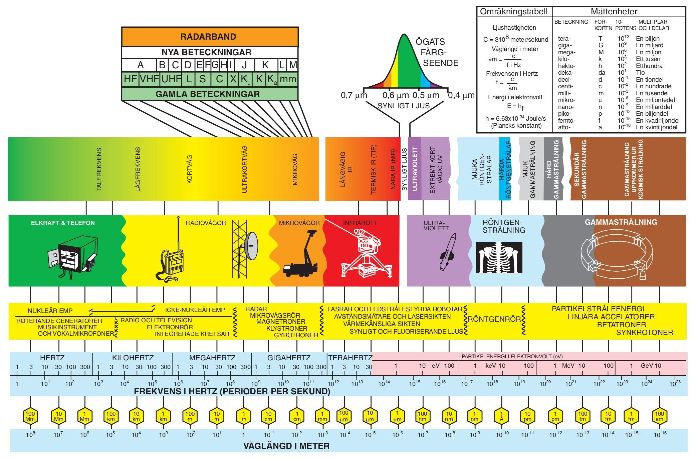
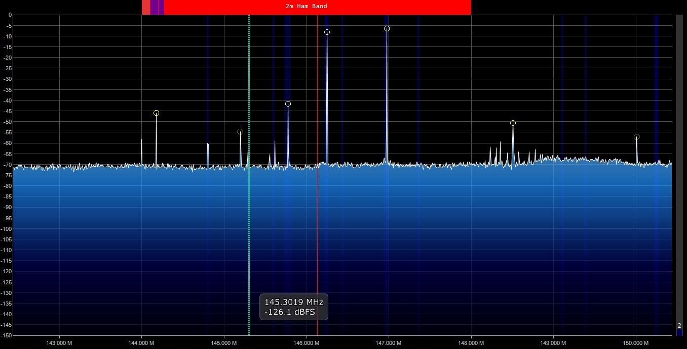

# Vad är en signal?

## Inledning

### Syftet med utbildningen

Att ge en individen, oberoende fördjupningsområde, en förståelse för grundläggande fysik med utgångspunkt från specifik verksamhet och nomenklatur. Utbildningen skall genomföras under individens första tid för att ge möjligheten att se samband mellan fysik och de begrepp och den teknik som vardagen består av. Känslan av verksamheten består av ”svart magi” ska minska. Utbildningen skall också ses som en grund till vidare teknisk utbildning inom respektive fördjupningsområde, som i många fall kommer många veckor senare.

### Målet med utbildningen

Efter genomförd utbildning ska individen kunna se grundläggande samband mellan fysik och teknik inom följande områden:

- Sinusvågen
- Tid och frekvens
- dB och brus
- Kapacitet
- Signalens väg

### Avgränsningar

Utbildningen syftar inte till att förklara hur tekniken fungerar då det tillhör utbildning som genomförs inom ramen för respektive fördjupningsområde.

Den syftar heller inte till att härleda fysikaliska och matematiska samband utan istället skall sambanden påvisas.

### Tidsåtgång

TBD
LABB

## Index

- [Kapitel 1: Sinusvågen](#chapter-1-sinusvagen)
- [Kapitel 2: Tids och frekvensdomän](#chapter-2-tid-v-fq)
- [Kapitel 3: Frekvensspektrumet](#chapter-3-frekvensspektrumet)
- [Kapitel 4: Brus](#chapter-4-brus)
- [Kapitel 5: Kapacitet](#chapter-5-kapacitet)
- [Kapitel 6: Signalens väg](#chapter-6-signalens_vag)

---

<h2 id="chapter-1-sinusvagen">Kapitel 1: Sinusvågen</h2>

### Definition

Oberoende överföringsteknik eller kommunikationsform är det sinusvågen som är möjliggöraren. När sinusvågen färdas i ett godtyckligt medium breder den ut sig likt vågringar på vatten. Vågen existerar i tre dimensioner. 

 

> *"En sinusvåg är den naturliga svängningsrörelsen för ett fritt svängande system."* Här finns mer att läsa om [sinusvågen.](https://sv.wikipedia.org/wiki/Sinusv%C3%A5g)

 
Sinusvågen defineras med hjälp av ett antal egenskaper.
 

$y(t) = A \cdot \sin(2 \pi f t + \phi)$

- $A$ = Kurvans amplitud
- $f$ = Kurvans frekvens
- $\phi$ = Kurvans fasförskjutning

### Varför är det viktigt?

När en sinusvåg färdas i ett godtyckligt medium vid vissa frekvenser, gör den det i form av elektromagnetisk energi och benäms ofta som en *radiosignal*. En sändare genererar signalen som i sin tur tas emot av mottagaren. För att signalen ska kunna bära information behöver sändaren och mottagaren komma överens om ett gemensamt "språk". Sändaren behöver alltså ändra signalens egenskaper så att mottagaren i sin tur kan översätta ändrigarna till information.

Dessa engenskapsförändringar, eller anpassningar, benäms *modulation*. När sändaren modulerar en omodulerad signal (CW) och överför den, kommer mottagaren att *demodulera* samma signal för att komma åt informationssignalen. 

<!---
17_lektioner.pdf sidan 65
-->

---

<h2 id="chapter-2-tid-v-fq">Kapitel 2: Tids och frekvensdomän</h2>

### Definition
Vi har i förra kapitel tittat på matematiska och fysikaliska fenomen med avseende på tid, där tiden utgjort x-axeln i grafen. Ett annat och minst lika vanligt sätt att beskriva signalen är att göra det utifrån dess frekvens.

I enkla ord:

- **Tidsdomän**: Visar hur en signal förändras över tid. Du ser signalens värde vid varje ögonblick.
- **Frekvensdomän**: Visar hur mycket av signalen som finns vid olika frekvenser.

### Varför är det viktigt?
Det finns många anlednigar till varför man vill kunna analysera en signal med avseende olika domänder men den mest uppenbara är underlättandet att studera repetitiva fenomen, till exempel radiovågor. I grafen nedan illustreras en signal i tidsdomänen med tid (s) på x-axeln och ytterligare en signal i frekvensdomänen med frekvensen (Hz) på motsvarande axel.

 

 

> Sambandet mellan ljusets utbredningshastighet c i vakuum, frekvensen f och våglängden λ:   $λ = c / f$  
> Frekvensen är det inverterade värdet av periodtiden:   $2 \times 10^{14}$

> *Transformteori* är ett sammanfattande namn på de delar av matematiken som beskriver transformer. Här kan du läsa mer om [Fouriertransform](https://sv.wikipedia.org/wiki/Fouriertransform)

---

<h2 id="chapter-3-frekvensspektrumet">Kapitel 3: Frekvensspektrumet</h2>

### Definition
Ett frekvensspektrum är ett avgränsat område med frekvenser. Inom radiotekniken anses det användbara frekvensområdet omfatta frekvenser mellan 10 kHz till 300 GHz. Det är dock långt ifrån det enda definerade frekvensspektrumet. Som exempel nyttjas spektrumet för ljus när information överförs i [fiberoptisk kabel.](https://en.wikipedia.org/wiki/Wavelength-division_multiplexing)

 

I figuren nedan ses en skärmdump tagen över ett skarpt frekvensspektrum. En radiomottagare som kopplats till en dator har konfigurerats att motta signaler runt om kring 140 MHz - 150 MHz. X-axeln visar frekvensen och y-axeln visar amplituden. Mitt i figuren ses ett antal signaler som i detta fall bär en nyttosignal. Fleralet av de nyttosignaler som mottagaren tar emot har mjukvaran markerat med gula cirklar för att påvisa signalens amplitud. 

Utöver att mottagaren tar emot signalen med en viss signalstyrka, alokerar signalens bredd ett visst frekvensutrymme. Signalens bredd benäms bandbredd. Bandbredden är ett mått på det frekvensområde som en signal upptar, och en högre informationsöverföringshastighet kräver ett större frekvensområde för att kunna överföra mer data per tidsenhet.

I foten på nyttosignalerna ses ett blått område som övergår i svart. BRUS.........
 

> Vill du börja leta signaler? Hobbyn är billig och kräver ingen särskilld förkunskap. Läs mer om [SDR.](https://www.rtl-sdr.com/rtl-sdr-quick-start-guide/)

---

<h2 id="chapter-4-brus">Kapitel 4: Brus</h2>

### Definition

---

<h2 id="chapter-5-kapacitet">Kapitel 5: Kapacitet</h2>

### Definition

---

<h2 id="chapter-6-signalens_vag">Kapitel 6: Signalens väg</h2>

### Definition

---

**Skapare:** Johannes Andersson

**Datum skapad:** 2025-01-15  

